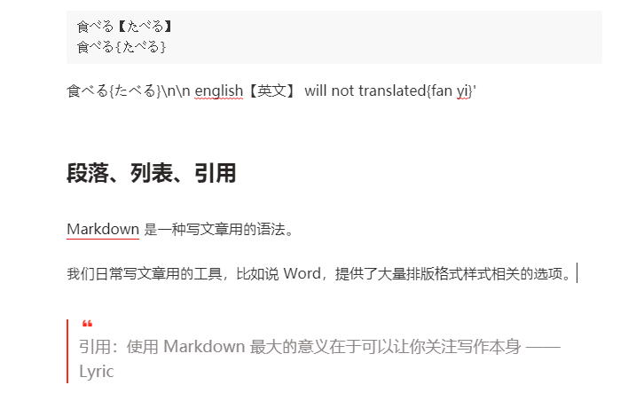
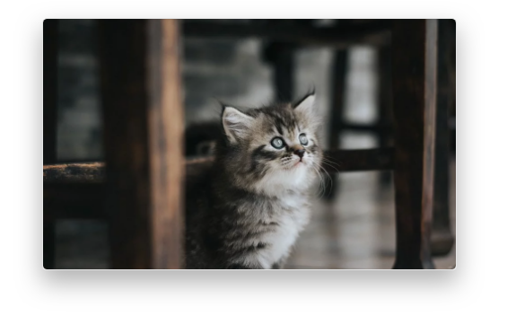

# 须知

如要关注该项目更新动态请点击`Watch`，如支持/收藏该项目请点击`Star`。

不要`Fork`！不要`Fork`！不要`Fork`！

# typora-theme-css

## 下载少数派typora主题皮肤

这里有一份typora下的少数派排版风格主题，请注意查收。

相信很多少数派作者都跟我有同样的痛苦，富文本与纯文本字之间的切换，令排版非常困难。往往到了上传到站点的时候，甚至想清空格式，然后手动编辑一遍。

> 天下苦sspai编辑器久矣。

少数派风格主题的typora皮肤来啦，在少数派官方、typora，以及任何markdown编辑器之间进行无缝切换，更加顺滑的`markdown`编写体验，更好的排版样式。

### 😋 食用指南

[下载](https://github.com/sheilaCat/typora-theme-css)或者是直接复制`sspai.css`文件，到你的typora主题文件夹下面即可。

重新打开你的typora软件，主题中就可以进行选择应用。使用的过程中，有什么意见或者建议，欢迎提issues或者直接站内私信我。

### 😀 支持markdown常规文本



### 🥰 支持图片处理：增加阴影、自动缩放

优化了图片标签：

- zoom：自动缩放
- shadow：给图片增加类似mac窗口的阴影
- zoom-shadow / shadow-zoom

```markdown
说明文字
```



### 😥 不支持脚注

虽然支持`<sup>脚注</sup>`这样的写法，但是少数派站点的脚注是需要根据标签内部包括的`div`中`sup-text`标签来取用的，这样就不满足`markdown`写法啦，所以不支持。

### tips：富文本与markdown之间的转换

直接把富文本复制到typora中，会处理为对应的markdown格式。
